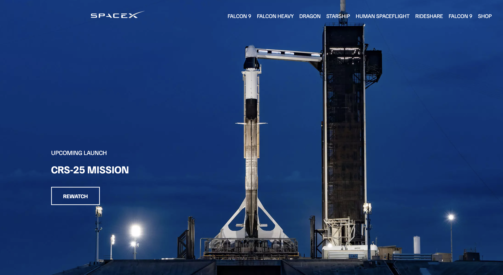

# spacex-website

    
    

SpaceX website clone using HTML and CSS.

Click [here](https://spacex-c02fd.web.app/) to view the hosted website

## Tools & Technologies:
* HTML
* CSS
* VSCode
* Firebase
